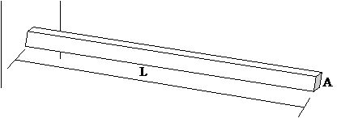
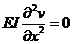
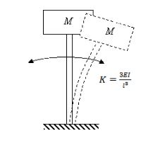
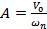
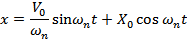

### Theory

**A. Beams and Cantilever**

Beams are structural members that have smaller dimensions of cross sections compared to its length (its axis) and are subjected to loads perpendicular to its axis; i.e. they are subjected to transverse loads. The whole beam deforms in the plane containing the axis and the transverse loads. We say that the beam bends. The beams are usually supported at both ends and they are termed differently depending on the support conditions.
      When one end of a beam is fixed, and the other free, it is called a Cantilever beam, or simply a Cantilever. When both end-supports re simple, the beam is called a Simply Supported Beam. If both ends of a beam are fixed, it is a Fixed-Fixed Beam or simply a Fixed Beam.

**B. Physical systems that can be modeled as cantilever:**

The diving board on a swimming pool, the slab on a porch, wall mounted structures, overhanging booms of cranes, etc can be modeled as cantilever. These physical systems can be idealized with loss of some accuracy and generalization but ability and simplicity of analysis. The vibration characteristics of these systems can be very well understood by knowing the vibrations of its cantilever model.      
As explained in the general theory, the characteristics of natural vibration are extremely important in knowing the response of the systems to forced excitations.

In this experiment, we shall find out the natural frequencies of a cantilever from its response to harmonic support-excitation.

**C. Natural Vibration of a Cantilever - Natural frequencies and mode shapes**

 A Cantilever is a continuous system-its mass and elasticity are distributed all over its volume. It can be considered to have infinite very small masses connected by infinite very small springs resist the banding of the Cantilevers. Hence there are infinite degrees of freedom and infinite natural frequencies. And also, corresponding to every natural frequency, it has a particular shape of vibration, called Mode Shape. The lowest natural frequency is called Fundamental natural frequency and corresponding mode, fundamental mode or simply the first mode. Here are animations for first three modes of vibration of a Cantilever. Click on the figures to see the modes.
	  
<table><tr>
<td></td>
<td></td>
<td></td>
</tr><tr>
<td>Mode - I</td>
<td>Mode - II</td>
<td>Mode - III</td>
</tr></table>	

	  
A cantilever of rectangular cross section bxd; Area of cross-section, A = bxd; and length L is shown in the figure. Cross-sectional dimensions are small compared to its length.
 
 
 
Let us consider its natural vibration in vertical plane, perpendicular to its length L. Let I be the second moment of the area of cross section about neutral axis perpendicular to the plane of vibration; 
 

 
Let E be the modulus of elasticity of the material from which the cantilever is made. For steel value E is taken as E = 210GPa (210x109 N/m2) and for Aluminum, it is 70 GPa
Let &rho; be the density of the material; for steel, &rho; = 7800 kg/m3; for Aluminum, &rho; = kg/m3

**D. Equation of Motion**

Once disturbed from its position of equilibrium and left to its own, the cantilever will vibrate naturally; it will perform natural vibration. From theory, we know that the vibration of a cantilever is governed by the equation 
	  

	  
 with the boundary conditions: at x = 0 (i.e. at fixed end): Deflection v(0,t) = 0 and Slope dv(0,t)/dx = 0, at all t and at x = L (i.e. at free end), Bending moment
 

	  
 and Shear force 
	  

	  
 
The initial condition is v(x,0) = 0
As both, boundary conditions and initial conditions, are specified, the problem is said to be of mixed initial value and boundary value problem.

For small amplitudes of vibration of the cantilever, the motion can be assumed to be harmonic and we can write this equation in terms of amplitude of vibration as a function of x alone. The equation is as follows:
 
		   

		   
 or 
		   

		   
There are infinite sets of V(x) and &lambda; which together satisfy the above equation. Such problems are called Eigenvalue problems and the solutions are called eigenvalues &lambda;i, and eigenvectors V(x)i.

V(x) is function of x that shows shape of the cantilever (Amplitudes of vibration at different values of x) corresponding to the respective frequencies of natural vibration &lambda;i. The shape of cantilever vibrating with certain natural frequency is called mode shape of cantilever for that frequency. Three of them were shown in figures earlier.

**E. Harmonic excitation, Resonance and Natural frequency**

When the cantilever is subject to forced vibration, it will vibrate. This can be done by holding the cantilever in a fixture, firmly mounting the fixture on a table of vibration shaker, and vibrating the shaker harmonically up and down with a known frequency. If we gradually change the frequency of vibration of the table within a range, say from 20 Hz to 2000 Hz, and note the amplitude of vibration of the tip of cantilever, we can plot a graph of amplitude of vibration of the cantilever versus frequency of excitation. We know that when the frequency of excitation matches with the natural frequency, the amplitude of response is large. Thus the frequencies in the graph mentioned just now corresponding to high values of response must correspond to the natural frequencies of the cantilever in the selected range of excitation frequencies. Thus, we find first few natural frequencies of the cantilever under test by exciting the support harmonically and carrying out the "Sine-Sweep"
	
	

**Vibratory systems around us**

Here are some examples of physical systems where the vibrations are prominent and can be observed easily. In musical instruments the vibrations are intentional. The parts of musical instruments are designed so that they generate sounds that are pleasant to listen. In many cases the vibrations are unwanted and we try to minimize them.

1.   A chandelier hanging from ceiling oscillates to and fro following an initial disturbance; maybe due to a breeze of air.

2.   The oscillations of the chandelier at cathedral of Pisa, Italy, were studied by the famous scientist Galileo Galilee.

3.   A load attached at end of a wire-rope of a crane oscillates to and fro due to initial disturbance; maybe due to sudden stopping of carriage of the crane while revolving about the vertical axis.

4.   The pendulum used in clock of olden days used to oscillate to and fro once every second. i.e. it had a period of oscillation of one second.

5.   String of a guitar, when plucked and left to its own, vibrates and makes a musical sound. It comes to rest after a while; the vibrations die out. Similarly, the diaphragm of a table vibrates when hit and left to its own. It also comes to rest after some time.

All these are examples of vibratory systems that are set into vibration following an initial disturbance. All these systems have three components: mass, due to which the system possesses inertia; elasticity, due to which potential energy can be stored; and components that dissipate energy causing the vibratory motion to be damped which bring them to rest after some time.
      
Vibration or vibratory systems are classified in number of ways. Some of the classifications are given below: 

 **Free and forced vibration** - A free vibration occurs due to initial displacement or velocity, or both, applied to the system only initially. There is no external force acting on the system when the system is vibrating. A forced vibration occurs when the system vibrates in response to external force applied continuously. When the force applied is periodic, i.e. it repeats itself after a fixed interval of time, the forced vibration is called periodic. If the periodic force and hence the resulting vibration varies sinusoidally with respect to time, the vibration is called harmonic. If the force is not periodic, the forced vibration is called aperiodic or random.

 **Damped and undamped vibration** -
When the vibratory system has elements that offer resistance to motion, energy is continuously dissipated and the free vibrations of such systems come to halt after some time. This is called damped vibration and such systems are called damped systems. Forced vibration of a damped system continues as long as the force acts but some of the work done by the external force is lost in overcoming the resistance offered by the damping elements. Systems without damping elements are called undamped systems and their vibrations are called undamped vibrations. All systems in nature have some or the other damping element and their natural vibrations are damped. Hence they come to rest after some time following free vibrations. Nevertheless, we study the vibration of undamped systems because the concepts developed in studying them are useful in analyzing and understanding the phenomena occurring in vibration of damped as well as complicated systems. When the force of resistance offered by a damping element is proportional to velocity of mass of the system, it is termed as viscous damping and the damping element is called a viscous damper. If the force of resistance has a constant value, it is termed as Coulomb damping. Damping due to dry friction shows this kind of behavior. Coulomb damping can occur when the system has components rubbing over each other. There are other types of damping also which shall be discussed later.

**Degrees of freedom** : The vibratory systems are classified as single-degree-of-freedom systems, Multi-degree-of-freedom-systems or continuous systems. The number of degrees of freedom corresponds to the number of independent co-ordinates required to completely describe the motion of the system. In fact, it is the sum of the possible ways each mass can move independently of other masses. The translation of a mass along the three axes, X, Y and Z, and the three rotations about each of these axes constitute possible ways of motion of a mass. Many times, many of these six motions of a mass are restricted and a mass can have one or two degrees of freedom, i.e. only translation or translation and rotation of a single mass about any one of the axes.

**Linear and Non-linear Vibrations** : Vibration is said to be linear if the damping force is proportional to velocity, inertia force is proportional to mass, and restoring force is proportional to displacement. If any of this proportionality is not satisfied, the system is said to be non-linear.

**Solving engineering problems** : Analytical methods are usually applied to models of actual systems. We carry out experiments on models if physical systems are not available for testing. While preparing such models, we exclude superfluous details of the system but include all essential and important features of the actual system. While doing so, we idealize and approximate important behaviour of the system without affecting much the accuracy in predicting the behaviour. The system model so developed provides ease of application of analytical and experimental techniques. Once a satisfactory model is developed, laws of Physics can be applied which give a set of mathematical equations relating the properties and variables of the system. Such a set of mathematical equations is called mathematical model of the system. Solving the set of equations (or a single mathematical equation) provides expression for the system variable in terms of location and time. We call this as 'solution' of the problem. As an illustration of the concepts described above, see the example given below.

<table>
<tr>
<td>Physical system</td><td colspan="2">These days we have number of towering buildings.  Many a times the residential part of such a building is supported on a tall concrete structure.  One of such buildings is the 'Milad Tower', situated in Tehran, Iran.  Its head consists of a large pod with 12 floors and below is a staircase and elevators to reach the area.

The oscillations of such tall buildings, in response to earthquake and wind, are important from design point of view.  And to study these oscillations, we must know the characteristics of its natural vibration. 

Analysis of such a physical system can be very much complicated.  To obtain first rough estimate of the natural frequency of vibration, the problem can be stated and the physical system can be modeled in a simple way as described below.</td>
 </tr><tr>
<td>Problem statement</td><td colspan="2">To find natural frequency of oscillation of the tower in the direction perpendicular to the vertical axis (i.e. natural frequency of transverse oscillation of the tower) and position of the head at any given time.</td>
 </tr><tr>
 <td>Physical model of the system</td><td></td><td>The physical model for the system under consideration can be as shown in This is the simplest model.  Only the mass of the building at the top is considered and it is considered to be concentrated at one point.  The mass of the vertical pillar supporting the buiding is neglected and is considered to be a cantilever offering only elesticity.

Thus it becomes a single degree of freedom system with single mass and only one way of motion of the mass: translation in direction perpendicular to the vertical axis of the building.  Further we assume that the amplitude of this motion to be small.

The equivalent stiffness of the cantilever is given by </td>
</tr>

</table>
.  The symbols carry their usual meanings.

**Mathematical model**

Using Newton's second law of motion, the equation of motion of the mass is written as

The first term is the inertia force which is equal to mass multiplied by acceleration and the second term is the spring force given by stiffness of the spring multiplied by its elongation or compression.

The differential equation is a mathematical model of the system.

**General Solution**

The solution to the above differential equation is given by

A and B are constants that depend the initial conditions, i.e. the displacement and velocity of the mass when we started measuring our time.

These are known as initial conditions.

 is the natural frequency in radians per second and is given by

**Particular solution obtained from the initial conditions**

Substituting the initial conditions in above expression, we can obtain the values of A and B.  Thus if X0 and V0 are the initial displacement and velocity, respectively, given to the mass, the above expression will yield values of A and B as  and

Now the expression for x becomes

And we can obtain the value of x at any time t from this expression.

Thus we have obtained the expressions for natural frequency and position of the head at any given time 't' and the problem stated by the problem statement is solved.

	  
